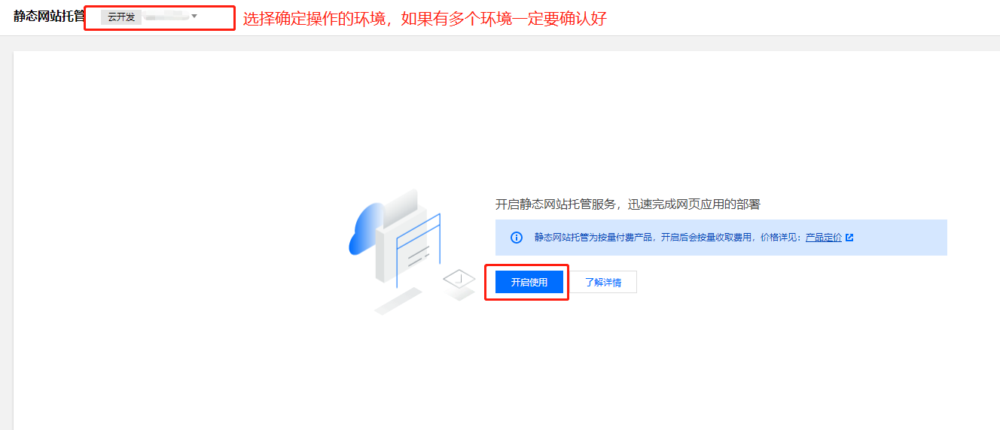
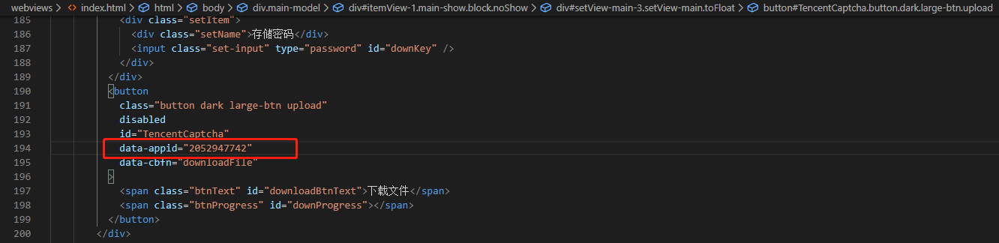
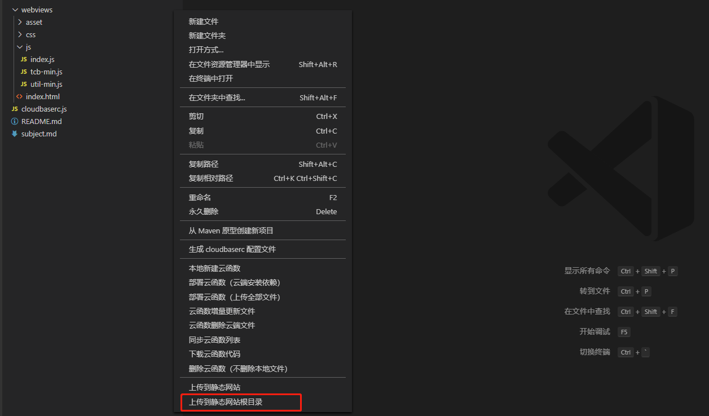

# 完全使用云开发构建文件存储转发工具

File-S文件转储服务用于无障碍跨平台文件传输，用户可以免登录存放和收取文件；应用于一些临时文件使用场景下的文件传输服务。
使用云开发的数据库、云存储、云函数、云接入能力，登录验证使用匿名登录。

[Zira冠宇](https://github.com/wasfzxt)

---
## 创建云开发环境
>> 3min

##### 一、新建【按量计费云开发环境】
进入[腾讯云云开发控制台-创建环境](https://console.cloud.tencent.com/tcb/env/index?action=CreateEnv)，选择按量计费环境，环境名称可以自定义设置。如果已有按量计费环境则可以跳到下一步。


##### 二、开通静态网站托管服务
进入[进入静态网站控制页](https://console.cloud.tencent.com/tcb/hosting/index),选择刚才创建好的环境，开通静态网站托管服务。


##### 三、创建数据库
进入[数据库控制页](https://console.cloud.tencent.com/tcb/database)，添加3个集合；集合名字分别为dustbin、file、manage


##### 四、开启匿名登录
进入[环境设置页-登录授权](https://console.cloud.tencent.com/tcb/env/login)的登录方式中，勾选匿名登录


---
## 下载并部署源码
>> 10min

##### 一、下载源码
访问[github仓库](https://github.com/TCloudBase/WEB-FILES),下载源码到本地。源码项目目录如下：


##### 二、导入初始化数据
找到项目目录下cloudfunctions/asset/manage-database.json文件，此为数据库集合manage的初始数据结构
进入[环境控制台-数据库](https://console.cloud.tencent.com/tcb/database)，点击进入manage集合,导入manage-database.json文件。如下图所示：


##### 三、本地运行
将项目webviews/index.html以http的形式运行，可使用IDE工具vscode，hbuilder。在浏览器的地址栏中确定url地址，比如例子中，域名地址为127.0.0.1:5500


##### 四、配置本地开发的安全域名
如果想在本地开发，必须要在云开发中配置本地的安全域名才能够正常调试开发。
进入[环境设置页-安全配置](https://console.cloud.tencent.com/tcb/env/safety),配置WEB安全域名，在这里以127.0.0.1:5500举例，请按照自己的实际域名配置


##### 五、填写云开发环境ID到项目中
云开发是通过环境ID来判定与特定环境进行数据通信的，所以在项目中要配置所有的相关环境ID为自己的ID。（建议熟练后，使用配置文件形式来配置）
- 进入[环境总览页](https://console.cloud.tencent.com/tcb/env/overview),复制获取云开发环境ID。
  
- 打开项目目录，将以下文件中标注有【云开发环境ID】处替换成自己的云开发环境ID
    - webviews/js/index.js 第1行
        

    - cloudbaserc.js 第2行
        

    - cloudfunctions/functions下所有目录的index.js文件，tcb.init()处
        

---
## 配置腾讯云验证码
>> 3min

###### 一、创建腾讯验证码
前往[腾讯验证码官网](https://console.cloud.tencent.com/captcha)创建验证码应用。


进入创建的验证码详情，基础配置，获得应用验证码aid和AppSecretKey。


##### 二、配置项目
打开cloudfunctions/functions/getFile/index.js，在第3行TCaptchaID中填充自己项目的aid和AppSecretKey；


在webviews/index.html大约119行（可能会格式化变行），id为TencentCaptcha的button元素，将属性data-appid填写为【应用验证码aid】


---
## 配置本地云接入同源策略
>> 3min

##### 一、说明
由于腾讯验证码需要获取IP地址，所以采用更灵活的云接入形式，将getFILE云函数支持http触发。因为浏览器有同学策略，所以我们需要配置getFile，保证能够正常的进行请求，同时过滤非法请求。

##### 二、配置
前往[静态网站控制台-设置](https://console.cloud.tencent.com/tcb/hosting/index?tabId=config)，复制域名信息下的默认域名；


粘贴至cloudfunctions/functions/getFile/index.js第9行AllowOriginList数组中第1项。另外还需要配置一下本地域名到数组中


---
## 部署云函数和HTTP触发
>> 7min

##### 一、使用npm安装服务端SDK
如果没有安装nodejs请自行前往官网安装。
在项目目录cloudfunctions/functions下的每个目录，都右键执行终端中打开。


在终端中输入以下命令，安装依赖。每个目录需要执行的命令如下：
- delete目录
    ```bash
    npm i tcb-admin-node
    ```
- downFile目录
    ```bash
    npm i tcb-admin-node
    ```
- getFile目录
    ```bash
    npm i tcb-admin-node
    npm i request
    ```
- myfile目录
    ```bash
    npm i tcb-admin-node
    ```
- upload目录
    ```bash
    npm i tcb-admin-node
    ```


##### 二、上传部署云函数
在cloudfunctions/functions下的每个目录，都右键执行部署云函数（上传全部文件）。在一开始使用时会出现登录，按照提示完成登录步骤即可。【如果没有此选项，请前往[云开发VSCODE插件](https://docs.cloudbase.net/vscode/intro.html)安装并学习使用】


##### 三、配置云函数HTTP触发
getFile云函数需要以HTTP形式对外提供服务，所以需要对该云函数配置http触发。
进入[云开发云函数列表页](https://console.cloud.tencent.com/tcb/scf/index)，选择getFile云函数。进入函数详情，如下所示：点击编辑


在http触发处配置路径：/getFile。点击保存


---
## 本地测试项目可用性
>> 5min

##### 一、重新启动项目，进入页面


##### 二、上传文件测试，选择文件进行上传


上传成功后如下图所示：可以复制分享，也可以继续存储


##### 三、查看存储的历史
点击查看我上传的文件


将会拉取从此处上传的文件


##### 四、取出下载文件
填写必要的取件号码，根据密码有无填写密码，点击下载文件


会弹出腾讯验证码，验证通过后才可以发起下载


##### 五、总结
如果本地验证都没有问题，则配置没有问题。如果出现任何一个步骤的错误提示，则F12控制台查看并排除原因，一般是环境ID写错，云开发服务端依赖没有安装等错误。

---
## 上传至静态存储
>> 2min

将本地验证成功的项目上传至静态存储中。在webviews目录右键点击，上传至静态网站根目录


进入[云开发静态网站管理页](https://console.cloud.tencent.com/tcb/hosting/index),可以看到已上传的项目。


进入[云开发静态网站设置页](https://console.cloud.tencent.com/tcb/hosting/index?tabId=config),访问默认域名网址即可进入线上项目


---
## 关于自定义域名和网站对外开放
>> 1min

云开发提供了完备的web端资源服务，但是一个对外公开使用的web项目需要有自己的备案域名，需要受到监管。所以，在正式对外推出之前，需要将云开发提供的默认域名替换成自己已经备案的域名

- 前往[云开发静态网站设置页](https://console.cloud.tencent.com/tcb/hosting/index?tabId=config)，在【域名信息】下点击添加域名按钮，填写已经备案的域名。域名需要配有SSL证书，腾讯云下域名会自动监测证书；如果是非腾讯云旗下域名，则需要上传SSL证书。
- 需要等待域名添加状态为【已启动】后，才可以去域名解析中配置CNAME。
- 前往[环境设置页-安全配置](https://console.cloud.tencent.com/tcb/env/safety)，在WEB安全域名中删除云开发的默认域名，只保留自定义域名。
- cloudfunctions/functions/getFile/index.js的AllowOriginList数组中，将默认域名更换成自定义域名，保存更新。
